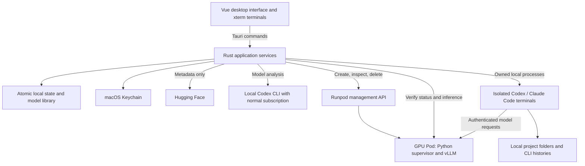

# AI Deck

AI Deck is a personal macOS desktop app for running coding models on temporary Runpod GPUs while working in local projects with Codex or Claude Code. It brings model selection, GPU setup, endpoint checks, embedded terminals and cleanup into one workspace.

The app is built with **Tauri, Vue 3, TypeScript and Rust**. A small Python supervisor runs inside the GPU container. Codex is the primary coding integration; Claude Code support is experimental.

## What you can do

1. **Choose a model.** Use a bundled catalog profile or paste a Hugging Face URL. The app reads the model's metadata and asks your signed-in local Codex CLI to suggest hardware for one coding session.
2. **Review the model and cost.** See published model details alongside the suggested GPU memory, usable context range, CPU memory, disk/cache requirements and Runpod price snapshots. Suggestions are saved locally for reuse; refreshing prices does not rerun Codex.
3. **Provision Runpod.** Choose compute, region and temporary or retained model storage. Paid creation requires opt-in, spending/lifetime limits and confirmation.
4. **Enable the endpoint.** After the model starts, the native app checks authentication, model identity and inference before allowing it to serve new sessions.
5. **Open a coding CLI.** Each embedded terminal uses a local project folder, its own CLI state and an explicit binding to the selected deployment.
6. **Finish the deployment.** Interrupt affected local sessions and verify that the owned Pod has been deleted.

Closing a terminal or window leaves the Pod running. Retained network volumes survive termination and continue to incur storage charges. The local cleanup timer cannot protect against app closure, sleep or loss of connection.

## Current status

The desktop workflow and local regression checks are implemented. **No paid Runpod tests have been performed.** Bundled profiles and imported AI suggestions are unverified candidates, not proven runnable configurations. A successful real-subscription model analysis and real coding sessions on the chosen GPU remain owner-operated checks.

Paid provisioning defaults to off. The maximum configurable GPU rate is **USD 10/hour**; storage is separate. A published model context limit describes its saved configuration, while the AI's usable context range estimates what might fit the proposed GPU setup. Neither is a measured performance guarantee.

See the [local validation record](docs/local-validation.md) for completed checks and remaining live acceptance gates.

## High-level architecture



### Interface and native services

Vue organizes the app into Setup, Models, Projects, Deployments and Sessions. `src/shared/useDeck.ts` owns shared UI state and the command/event bridge. The interface requests actions through Tauri; Rust owns cloud calls, credentials, filesystem access, validation and process management.

`AppCore` composes the state store, credential store, provider/runtime clients and terminal manager. Focused services handle provisioning, reconciliation, endpoint enablement, session lifecycle and model imports. Provider, credential, runtime and analyzer interfaces allow tests to substitute local fixtures. Model analysis has a separate lock so it cannot block deployment cleanup.

### Model library and configuration

Hugging Face imports resolve a URL to an immutable revision, read bounded metadata/config/card files, obtain Runpod hardware prices and request structured analysis from the local Codex CLI. Rust validates the result and calculates prices from provider quotes. A usable proposal becomes an untested catalog profile; unsupported proposals stay in the library for reference.

Model facts come from saved Hugging Face metadata/config. Hardware and usable-context suggestions come from Codex. The app displays these separately and reuses the same components in the model library and deployment preparation. It does not download model weights during import.

`model-catalog/catalog.json` is the source for bundled model/runtime settings. Rust owns catalog validation, shared data types and defaults. `npm run contracts` generates frontend contracts, default settings and the catalog JSON schema. Each deployment retains its full resolved profile snapshot, so editing the library cannot silently change existing sessions.

### Persistence and credentials

The app uses an atomic JSON state store in Tauri's application-data directory, with an exclusive application lock. It stores projects, deployments, session records, settings and imported models; no separate database server is needed. Updates are written privately and durably before becoming the in-memory state. Invalid saved state is reported rather than reset.

Runpod management and deployment credentials are held in macOS Keychain. Model-analysis runs use the owner's normal Codex subscription login. Coding terminals use separate app-owned CLI state and deployment inference credentials. These are distinct routes; the app does not rewrite the user's ordinary terminal configuration.

### Remote runtime and lifecycle

The native provisioner sends the reusable `containers/vllm-runtime/launcher.py` supervisor to the pinned vLLM image. The supervisor checks model access and cache capacity, downloads the pinned weights, starts vLLM and exposes authenticated startup status. Inference goes directly to vLLM; there is no custom response-translation service.

Provisioning, enabling and opening a CLI remain separate actions. Durable creation intent, ownership checks and reconciliation handle uncertain provider responses. Finish waits for verified cloud deletion and local process cleanup. Stopping a process or container alone is not proof that Runpod billing has stopped. Independent offline expiry is not verified.

## Project identity

The project folder and npm/Cargo package are `ai-deck`, the Rust library is `ai_deck`, and the desktop product is **AI Deck** (`AI Deck.app`). Runpod remains the cloud provider, so provider APIs, settings and service filenames retain the Runpod name.

The installed-app identifier and Keychain service stay `com.runpoddeck.desktop` so existing local state, model imports, credentials and session folders remain accessible. The Codex provider ID and Pod ownership/runtime environment keys also retain their original values because saved histories and running Pods reference them. These are compatibility contracts, not branding to replace during routine cleanup. Historical audit paths remain as originally recorded.

## Repository map

| Location | Responsibility |
| --- | --- |
| `src/features/` | Vue screens and feature components |
| `src/shared/` | UI state, common components, styles and generated contracts/defaults |
| `src-tauri/src/` | Native services, provider clients, credential storage, CLI adapters and process control |
| `src-tauri/examples/export_contracts.rs` | Generates shared contracts, defaults and catalog schema |
| `src-tauri/tests/` | Native lifecycle, persistence, isolation, HTTP and terminal regressions |
| `model-catalog/` | Bundled model/runtime definitions and generated schema |
| `containers/vllm-runtime/` | Python startup supervisor embedded by the provisioner |
| `tests/runtime/` | Offline Python runtime tests |
| `tests/ui/` | Vue component and event-handler tests using existing compiler packages |
| `docs/` | Operating guidance, design decisions, compatibility limits and validation evidence |
| `Makefile` | Mac setup, development, checks, tests and packaging commands |
| `AGENTS.md` | Development rules, with focused guidance in relevant subdirectories |

## Develop and build

From the project root, use the [Makefile](Makefile). It works with the Make shipped by Apple's command-line tools and delegates existing build/check/test tasks to `package.json`.

### First setup on a colleague's Mac

Install these prerequisites through your team's approved process:

- Xcode or Xcode Command Line Tools, including `make`, Clang and the macOS SDK. For desktop work, the command-line tools can be installed with `xcode-select --install`. See [Tauri's macOS prerequisites](https://v2.tauri.app/start/prerequisites/#macos).
- Node.js and npm compatible with the locked Vite dependency. `make doctor` prints its engine requirement directly from `package-lock.json`; `make setup` enforces it during installation. See [Vite prerequisites](https://vite.dev/guide/).
- Rust/Cargo with Rustfmt and Clippy. For a rustup-managed installation, add missing components with `rustup component add rustfmt clippy`. Follow the [official Rust installation guide](https://www.rust-lang.org/tools/install) if Rust is absent.
- Python 3.9 or newer for the offline runtime tests. These tests need no pip packages.

The currently verified toolchain is Node 24.21.0, npm 12.0.2, Rust 1.98.1 and Python 3.14.7 on Apple Silicon. Other supported versions may work; dependency upgrades and toolchain changes still require approval. Make does not install system tools or upgrade them automatically.

After cloning, run these commands **separately**, in order:

```sh
make doctor  # Check prerequisites without installing anything
make setup   # Install npm dependencies and fetch Rust crates from the lockfiles
make verify  # Run checks and all regular local tests
make dev     # Open the desktop app with development reload
```

`make setup` needs network access and replaces `node_modules` using `npm ci --engine-strict`; Cargo fetch uses `--locked`. It does not modify lockfiles or install global packages. Run it again after dependency lockfiles change. Cargo may also fetch missing crates during a later build or check; none of these commands uses a cloud inference account. Regular tests do not require Runpod credentials, model weights, Docker, Codex or Claude Code installations. The coding CLIs are needed when using the corresponding app features.

### Everyday commands

| Command | What it does |
| --- | --- |
| `make` / `make help` | List targets; no build or install starts by default |
| `make dev` | Start the native desktop app |
| `make preview` | Start the browser preview, without native actions |
| `make contracts` | Regenerate contracts/defaults/schema after changing their Rust sources |
| `make check` | Check generated-file drift, Vue/TypeScript build, Rust formatting and Clippy |
| `make test` | Run all regular local tests |
| `make test-ui` / `make test-runtime` | Run a focused UI or Python test suite |
| `make verify` | Run `check`, then `test`, sequentially even with `make -j` |
| `make build` | Build the macOS `.app` for the host architecture |
| `make clean` | Remove only `dist/`, `src-tauri/target/` and `src-tauri/gen/` |

The app bundle is written to `src-tauri/target/release/bundle/macos/AI Deck.app`. Open it from Finder. The configured minimum system version is macOS 13. The personal build has been verified on Apple Silicon; an Intel build is not yet verified, and a default host build is not a universal binary. Distribution signing/notarization is not configured. Follow the [operating guide](docs/operating-guide.md) for account, CLI and project setup.

If the checkout is moved and Tauri reports generated files under its previous absolute path, run `make clean`, then rebuild. Cleaning removes built app bundles but preserves `node_modules`, project sources, lockfiles, app data and Keychain credentials.

## Validation and development conventions

`make verify` is the common pre-review check. The underlying `npm run contracts`, `npm run check` and `npm test` commands remain available and define their respective behavior; the Makefile does not duplicate those command chains.

Regular tests use fake cloud services, disposable directories, local pseudo-terminals and loopback HTTP servers. They do not create Runpod resources, download model weights or invoke paid inference. Some environments require permission for local listeners and child processes.

Optional installed-CLI probes are ignored by the regular suite. They use fake credentials and a localhost rejection server, and require the exact supported installed versions:

```sh
cargo test --manifest-path src-tauri/Cargo.toml --test installed_cli_smoke -- --ignored --nocapture
```

A rejection probe validates routing and arguments, not successful model compatibility. Other opt-in probes and their results are described in [model import](docs/model-import.md) and [local validation](docs/local-validation.md).

Read [AGENTS.md](AGENTS.md) before changing the code. Reuse existing sources of truth, keep generated files generated, preserve saved state and credentials, and validate changes with relevant local checks. Git commits, pushes and merges are managed by the owner. Paid experiments require separate explicit authorization.

## Further reading

- [Operating guide](docs/operating-guide.md): daily setup, sessions and cleanup.
- [Hugging Face model library](docs/model-import.md): analysis, model details, persistence and reuse.
- [Model compatibility](docs/model-compatibility.md): evidence requirements and unsupported assumptions.
- [Design decisions](docs/decisions.md): approved scope and provider constraints.
- [Implementation re-audit](docs/implementation-re-audit.md): historical findings and their fixes.
- [Original project plan](runpod-coding-desktop-project-plan.md): intended scope and acceptance gates.
