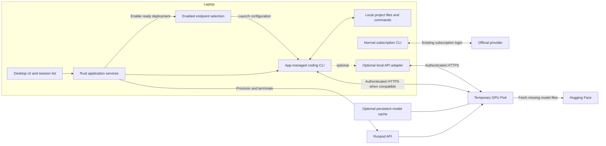

# Runpod Coding Desktop — Project Plan

Prepared: 5 October 2026  
Status: Local macOS implementation packaged and locally validated, with a USD 10/hour GPU ceiling. Owner explicitly deferred paid tests and will test later; live acceptance gates remain pending. See [decision record](docs/decisions.md).  
Working name: Runpod Coding Desktop. The final product name is undecided.

## 1. Project objective

Build a desktop app that launches temporary Runpod GPU Pods, runs a selected Hugging Face coding model, and lets the user explicitly enable a Pod's endpoint for local coding-agent sessions opened inside the app.

The coding CLI runs on the user's laptop. File reads, edits, commands, and tests happen in the selected local project. Model inference happens on Runpod. The user can simultaneously run their normal Claude Code or Codex subscription sessions outside this app.

The intended workflow is:

1. Select a tested model profile and review its GPU configuration, estimated running cost, and maximum runtime.
2. Click **Provision Runpod** to create a temporary Pod with a reusable Docker image.
3. Download missing model files or reuse cached files, then load and verify the model.
4. When the Pod is Ready, click **Enable** to select its endpoint for in-app CLI sessions.
5. Select a local project and click **Open Codex** or **Open Claude Code**, subject to the profile's tested compatibility.
6. The app launches that CLI with the enabled endpoint, model, credentials, and isolated configuration already applied. No manual URL copying or terminal configuration is required.
7. Work with the CLI and switch between sessions in the app.
8. Finish and terminate the Pod; its enabled route becomes unavailable.
9. Repeat later with the same or a different model.

Local files remain on the laptop, but relevant source code, prompts, and command output are sent to the hosted model as conversation context. Local execution does not mean that all project data stays on the laptop.

## 2. Agreed requirements and open decisions

### Established requirements

- macOS first, with a practical path to Windows later.
- Temporary Runpod Pods: create, use, terminate, and recreate when needed.
- Reusable serving images with model-specific configuration where possible.
- Support authenticated downloads from gated or private Hugging Face repositories.
- A CLI launcher and a list of local coding sessions.
- A separate **Enable** action after provisioning; newly opened in-app CLIs use the enabled Runpod endpoint automatically.
- The target app offers both Claude Code and Codex launch options, with actual availability tied to tested model compatibility.
- Independent configuration and credentials for app sessions and normal subscription sessions.
- Local project editing and command execution.
- No requirement to build a unique Docker image for every model.

### Starting choices — approved in Phase 0

The owner approved these foundation choices on 5 October 2026. The later instruction to implement first and defer paid tests supersedes the original order of live-dependent phases; their exit gates remain open.

| Decision | Proposed starting point | Reason |
| --- | --- | --- |
| Desktop stack | Tauri, Vue 3, TypeScript, Rust | Fits the owner's stack and leaves a Windows path |
| First CLI | Codex CLI | Documented custom-provider support |
| First serving engine | A pinned vLLM image | Reusable images and documented coding-CLI integrations |
| First interface | Embedded terminal with session sidebar | Preserves the CLI interaction model |
| Initial deployments | One active Pod and one loaded model | Keeps lifecycle and routing manageable |
| Enabled endpoint | One selected endpoint for new in-app CLI sessions | Matches the explicit Provision -> Enable -> Open CLI workflow |
| Initial sessions | One session for the proof; multiple sessions for the MVP | Adds concurrency only after the basic loop works |
| Model selection | Small catalog of tested profiles | Avoids promising compatibility with arbitrary Hub repositories |
| Storage | Ephemeral by default; persistent cache optional | Supports fully temporary use and repeat-use optimization |
| Distribution | Personal macOS development build first | Packaging follows functional validation |

Tauri supports web frontends and native application logic across desktop platforms. Windows still needs its own process, terminal, credential-storage, and packaging validation. [Tauri documentation](https://v2.tauri.app/start/)

### Decisions needed before paid experiments

- First model repository, exact revision, and quantization variant.
- Acceptable hourly GPU cost and total experiment budget.
- Initial GPU type/count and allowed locations.
- Embedded terminal or custom chat UI for the first release.
- Whether to retain a paid network volume between runs.
- Whether the first release is personal-use software or intended for distribution.
- Maximum Pod lifetime and the intended behavior when the app quits.
- What should happen to already-running sessions when a different endpoint is enabled. The proposed default is to preserve their existing binding and apply the change to newly opened sessions.

Do not infer these values from examples in upstream documentation. Obtain the owner's choices before work that depends on them.

## 3. Compatibility facts that shape the design

### Codex

Codex supports custom providers and stores configuration/state under `CODEX_HOME`. The proposed app uses its own state directory and explicitly configures the remote provider. [Codex configuration](https://learn.chatgpt.com/docs/config-file/config-advanced)

A Codex gateway must preserve the Responses API behavior needed for streaming, follow-up turns, and tool-call/result pairs. A successful text response or an endpoint described as OpenAI-compatible does not prove coding compatibility. [Codex gateway requirements](https://learn.chatgpt.com/docs/enterprise/gateway-compatibility)

### Claude Code

Claude Code supports gateway routing, but Anthropic explicitly does not support routing it to non-Claude models. Any self-hosted-model integration must therefore be labeled experimental and validated separately. It must not block the Codex MVP. [Anthropic gateway support](https://code.claude.com/docs/en/llm-gateway)

Claude Code exposes `CLAUDE_CONFIG_DIR` for separate settings and history. Gateway authentication must also be configured explicitly; changing only the base URL does not replace subscription authentication. [Claude environment variables](https://code.claude.com/docs/en/env-vars), [gateway authentication](https://code.claude.com/docs/en/llm-gateway-connect)

### Serving runtime and bridge

vLLM documents direct integration paths for both CLIs. First test whether its pinned version and selected model already provide the required API behavior. Add protocol translation only for an observed gap. This is technical integration evidence, not an Anthropic support commitment. [vLLM Codex integration](https://docs.vllm.ai/en/latest/serving/integrations/codex/), [vLLM Claude Code integration](https://docs.vllm.ai/en/latest/serving/integrations/claude_code/)

A bridge cannot give a model coding ability or reliable tool use that it does not have. Its purpose is routing and, when necessary, translating supported protocol behavior.

## 4. Proposed architecture



Keep these responsibilities distinct:

| Component | Responsibility |
| --- | --- |
| Desktop UI | Models, projects, deployment progress, terminals, session list, actionable errors |
| Deployment service | Runpod lifecycle, ownership checks, reconciliation, cleanup |
| Model catalog | Versioned model profiles and validation evidence |
| Runtime launcher | Resolve one profile into container settings and startup arguments |
| Session service | Local process lifecycle, working directory, resume identifiers |
| Enabled endpoint selection | Single authoritative route for newly opened in-app CLI sessions |
| CLI adapter | Version detection, isolated launch configuration, resume/interrupt support |
| Credential service | OS credential storage and references to Runpod secrets |
| Optional API adapter | Proven protocol gaps; no unnecessary translation layer |
| Local state store | Deployment/session metadata and recovery state, without raw credentials |

Keep cloud management calls in the native backend. The frontend receives narrowly scoped commands and sanitized state. The model container does not receive the Runpod management API key.

For the first release, connect directly to the authenticated Pod endpoint if it passes compatibility checks. A stable localhost endpoint can be added later if endpoint changes or protocol adaptation justify it. Do not silently change the model serving an active conversation.

### 4.1 Provision, Enable, and Open CLI behavior

Provisioning and enabling are separate product actions. A running, healthy Pod can be Ready without being selected for CLI use. **Enable selects routing; it does not start GPU billing or create another Pod.** A provisioned GPU can incur charges while it waits for Enable.

| User action or state | Required app behavior |
| --- | --- |
| Provision Runpod | Create the configured Pod and display startup progress |
| Pod Ready, not enabled | Show Enable; keep the current enabled selection unchanged |
| Enable | Recheck readiness/authentication and atomically select the deployment for new sessions |
| Open Codex | Launch Codex with the enabled deployment's Responses configuration |
| Open Claude Code | Launch Claude Code with the enabled deployment's Messages configuration when the combination is available and tested |
| No enabled endpoint | Explain that a ready endpoint must be enabled before opening a connected CLI |
| Enabled endpoint unavailable | Show the failure and block new connected sessions; no silent subscription or other-model fallback |
| Terminate enabled Pod | Invalidate the enabled route and show affected sessions as disconnected/ended as appropriate |

The app resolves each CLI's API path and model mapping from the same enabled deployment record. Users should not maintain separate copies of endpoint settings for Claude and Codex.

Recommended handling for already-running sessions: their launch configuration remains bound to their original deployment. Enabling another endpoint affects new sessions. Offer a deliberate restart/resume action if the user wants to move an existing session; verify that the CLI supports the transition. Do not promise that changing the parent app's environment updates an existing CLI process. Confirm this policy in Phase 0 before implementation.

Persist the enabled deployment identity, not a blindly trusted URL. After app restart, reconcile its Pod and verify readiness before restoring it as usable. Recreating a terminated Pod requires a new Enable action.

Every terminal should show a small connection label containing the CLI, selected model, and deployment. The ordinary product flow stays **Provision Runpod -> Enable -> Open CLI**; provider variables and API details belong in diagnostics or advanced settings.

## 5. Model profiles and reusable Docker images

Use one profile as the source of truth for a tested deployment configuration. Several profiles may reference the same runtime image. Build another image only when a model needs different dependencies, patches, or a different engine.

vLLM's Docker image accepts model selection and engine options at startup; additional dependencies can require an extended image. [vLLM Docker documentation](https://docs.vllm.ai/en/latest/deployment/docker/)

### Required profile information

| Group | Fields |
| --- | --- |
| Identity | Stable profile ID, display name, schema version, profile version |
| Model | Hugging Face repository, immutable revision, tokenizer revision if separate, served-model name |
| Runtime | Engine, image digest, entrypoint/argument configuration, required runtime version |
| Hardware | Tested GPU types/counts, memory requirements, CPU RAM/disk needs, quantization |
| Inference | Context limit, concurrency limit, sampling defaults, tool and reasoning parsers, chat template |
| Connection | API protocol, container port, readiness behavior, endpoint authentication method |
| Access | Public/gated/private status and secret reference requirements; no raw token |
| Storage | Cache paths, supported storage modes, minimum free-space estimate |
| Validation | Tested CLI version, runtime/model combination, date, capabilities, known limitations |

Different model families may need different tool parsers and chat templates. Model support and reliable coding-agent behavior must both be tested. [vLLM tool calling](https://docs.vllm.ai/en/latest/features/tool_calling/)

Use pinned revisions and image digests for tested profiles. Revalidate changes to the model, runtime, parser, GPU configuration, or CLI version before marking the new combination supported.

Profile arguments must be structured data, not user-provided shell command strings. Keep internal launch parameters out of the ordinary user flow; provide an advanced view only where useful.

## 6. Credentials and Hugging Face access

### Credential ownership

| Credential | Proposed storage | Used by |
| --- | --- | --- |
| Runpod API key | macOS Keychain; platform equivalent on Windows | Native deployment service |
| Hugging Face token | Runpod Secrets; app stores its secret name/reference | Model downloader in the Pod |
| Inference endpoint credential | OS credential store, scoped to the deployment | App-managed CLI and model endpoint |
| Existing subscription credentials | Existing CLI storage | Normal external CLI sessions |

### First-time Hugging Face setup

1. The user requests access on each gated model's Hugging Face page and accepts its conditions.
2. After approval, the user creates a fine-grained token with read access to the intended repositories.
3. The user saves it as a Runpod secret, for example `huggingface_token`.
4. The app references that secret when provisioning a Pod:

```text
HF_TOKEN = {{ RUNPOD_SECRET_huggingface_token }}
```

Hugging Face access approval and token permissions are separate requirements. The same token can serve multiple models when its scope and the account's access allow it. [Gated models](https://huggingface.co/docs/hub/models-gated), [access tokens](https://huggingface.co/docs/hub/security-tokens)

Runpod resolves secret references into container environment variables at startup. Hugging Face libraries use `HF_TOKEN` for authentication. No interactive login is needed on each Pod. [Runpod Secrets](https://docs.runpod.io/pods/templates/secrets), [Hugging Face environment variables](https://huggingface.co/docs/huggingface_hub/en/package_reference/environment_variables)

### Implementation constraints

- Never bake credentials into images, tracked configuration, command examples, or model profiles.
- Redact credentials from request bodies, process diagnostics, logs, and exported support bundles.
- Keep the inference credential separate from the Hugging Face token and Runpod API key.
- Inject Hugging Face authentication through the environment; do not persist login files on the model cache volume.
- A secret name existing does not prove that its value can download a model. The app cannot assume it can read a stored Runpod secret back.
- With this storage design, verify protected-file access inside the launched Pod before a large download. Fail promptly and apply the configured cleanup policy when access is denied.
- Show a model-page link for missing approval, and a distinct token-permissions error when identifiable. Do not promise exact pending/rejected status when the API response does not reveal it.

## 7. Temporary Pods and storage

Runpod provides Pod creation and lifecycle operations through its API. Pod termination deletes Pod-local data, so app-owned session records remain on the laptop. [Runpod Pod management](https://docs.runpod.io/pods/manage-pods)

Support two explicit storage modes:

| Mode | After Pod termination | Next launch |
| --- | --- | --- |
| Fully temporary | No retained model cache for this deployment | Download missing model files again |
| Retained cache | Keep a separately managed network volume | Reuse the matching cached model revision |

Runpod network volumes exist independently of Pods. They incur storage charges while retained. For Pods, current documentation limits them to Secure Cloud and requires attachment during deployment; GPU availability depends on volume location. [Runpod network volumes](https://docs.runpod.io/storage/network-volumes)

### Cache behavior

- Point the Hugging Face model cache at the selected storage location.
- Preserve revision-specific files and detect incomplete downloads.
- Keep download authentication out of persistent cache directories.
- Cache compilation artifacts separately when compatible; invalidate them when required by the runtime/hardware combination.
- Cached weights still need to be loaded into GPU memory. Do not promise instant startup.
- Never delete a retained network volume as part of ordinary Pod termination.
- Cache deletion is a separate, explicit operation with affected storage clearly identified.

vLLM distinguishes model-weight caches from compilation caches; retaining both can reduce repeat startup work. [vLLM cache documentation](https://docs.vllm.ai/en/latest/deployment/docker/#persist-the-compile-cache-across-containers)

### Proposed deployment state machine

```text
Idle -> Validating -> Provisioning -> ContainerStarting
     -> Downloading -> Loading -> Verifying -> Ready
Ready -> Draining -> Terminating -> Terminated
Any active stage -> Failed -> CleanupPending -> Terminated
Lost/ambiguous API response -> ReconciliationRequired
```

Persist the deployment ID, Pod ID when known, profile version, resource ownership, and intended action before progressing. Terminal readiness must follow actual inference verification, not merely a RUNNING Pod status.

Keep the enabled selection separate from the deployment state machine. Ready describes the Pod's condition; Enabled describes the user's routing choice. Store that choice once and derive UI badges and CLI launch settings from it.

## 8. CLI and subscription isolation

The app launches existing local CLI installations using explicit executable paths, working directories, arguments, and a controlled environment.

- Use app-owned Codex state via `CODEX_HOME`; use an app-owned `CLAUDE_CONFIG_DIR` if Claude support is added.
- Generate provider configuration from the enabled deployment at session launch. Avoid modifying default user or project-level provider settings.
- Exclude inherited subscription/OAuth credentials and conflicting provider variables from app-managed launches.
- Explicitly select endpoint credentials; missing/invalid credentials must fail rather than use subscription billing.
- Do not copy, refresh, log out, or overwrite the user's normal subscription credentials.
- Verify how each pinned CLI version handles OS keychain entries, shared background services, and project settings. Separate directories alone are not proof of complete isolation.
- Keep each session bound to its deployment/profile version. Reconnecting to a new Pod requires validation before resuming.
- Preserve ordinary CLI permissions and approval prompts; do not bypass them to simplify integration.
- Keep Runpod and Hugging Face management credentials out of CLI child processes.

Multiple sessions can edit the same folder even when their credentials are isolated. Show that shared-folder condition clearly and let the user choose separate workspaces. Do not create branches or modify Git history automatically.

## 9. Phased implementation

Implementation update (6 October 2026): checkmarks below indicate completed local implementation with related local validation, not a passed cloud exit gate. See [local validation](docs/local-validation.md). The owner will run paid tests later. All Phase 1 cloud checks and both CLI compatibility exit gates remain pending.

Re-audit follow-up (6 October 2026): the seven reproduced defects have been corrected and covered by local regressions. See the [implementation re-audit](docs/implementation-re-audit.md) for original evidence and resolutions. Local checks now pass 35 Rust, 7 Python and 2 Vue component tests; all live acceptance gates remain open.

Phases 0–6 produce a proposed Codex-first macOS milestone. Phase 7 adds the requested Claude Code launch path, subject to its compatibility gate. Phases 8–9 are optional interface expansion and Windows work. Do not describe the complete two-CLI experience as delivered until both launch paths have been validated. Complete each exit gate before treating the next dependent phase as ready.

| Phase | Outcome | Depends on |
| --- | --- | --- |
| 0 | Scope, budget, first model, and development choices settled | None |
| 1 | Proven remote model + local coding CLI loop | 0 |
| 2 | Reusable runtime and tested model profiles | 1 |
| 3 | Automated Runpod lifecycle and authentication | 2 |
| 4 | Desktop foundation and isolated CLI launching | 1, 3 |
| 5 | Embedded terminals and session management | 4 |
| 6 | Recovery, cleanup, cost controls, macOS MVP release | 5 |
| 7 | Experimental Claude Code integration | 6 |
| 8 | Optional custom chat interface and expanded catalog | 6 |
| 9 | Windows support and packaging | 6; applicable later features |

### Phase 0 — Confirm scope and prerequisites

**Purpose:** Resolve choices that affect architecture or incur costs before implementation.

- [x] Inspect the destination repository and follow its existing instructions and conventions.
- [x] Confirm the proposed stack, interface, first CLI, and personal/distributed scope.
- [x] Select one self-hostable coding model and immutable revision.
- [ ] Confirm model access, runtime support, GPU compatibility, and available hardware.
- [ ] Agree on GPU rate limit, experiment budget, maximum runtime, and storage mode.
- [x] Verify installed development tools and CLI versions; request approval before adding dependencies.
- [x] Define window-close, app-quit, last-session-close, and explicit Finish behavior.
- [x] Confirm Provision -> Enable -> Open CLI as the primary interaction, and settle the policy for sessions already running when the enabled endpoint changes.
- [ ] Verify a provider-side expiry or independent cleanup mechanism that survives laptop disconnection; record any limitation.

**Deliverable:** A short decisions record with actual selected versions and budget values.

**Exit gate:** No unresolved choice blocks the first paid compatibility experiment.

### Phase 1 — Prove the full coding loop

**Purpose:** Prove the uncertain integration before investing in the interface.

- [ ] Start one temporary Pod with the selected runtime and model.
- [ ] Enable real authentication on the inference endpoint before exposing it.
- [ ] Test the direct runtime API first; document any concrete translation gap.
- [ ] Launch an isolated local Codex session in a disposable test project.
- [ ] Demonstrate the Enable selection feeding the CLI launch configuration without changing global CLI settings.
- [ ] Verify streaming, file reading, an actual edit, a safe command/test, and a follow-up that uses the result.
- [ ] Verify cancellation, model identity, and context-limit error behavior.
- [ ] Run a normal subscription CLI session alongside it and confirm independent routing/configuration.
- [ ] Test an invalid endpoint credential and confirm there is no subscription fallback.
- [ ] Record startup time, model-download time, basic latency, and estimated experiment cost.
- [ ] Terminate the experimental Pod and verify its deletion with Runpod.

**Deliverable:** A reproducible compatibility report for the exact model/runtime/GPU/CLI combination.

**Exit gate:** The CLI completes a real local coding task and a follow-up through Runpod. A chat-only response does not pass.

**If blocked:** Narrow the incompatibility, adjust the model/runtime or a minimal adapter, and repeat this phase. Do not claim support based solely on API naming.

### Phase 2 — Package the runtime and model catalog

**Purpose:** Turn the working experiment into repeatable deployments.

- [x] Define and validate one model-profile schema, including the shared minimum cache capacity/free-space requirement (F7 corrected).
- [x] Reference a pinned upstream image or build one thin reusable extension only if needed.
- [x] Implement startup configuration from structured profile fields.
- [x] Add bounded download/load timeouts, readiness checks, and sanitized startup logs. Transient failures are retried and successful startup history is preserved (F2–F3 corrected).
- [x] Configure model and compilation caches explicitly.
- [ ] Add a second compatible model profile using the same image where feasible. Two candidate profiles are implemented; live compatibility remains pending.
- [x] Record required tool parsers, templates, hardware, and known capability limits.
- [x] Validate that profile changes do not silently alter previously recorded sessions.

**Deliverable:** Reusable runtime definition, catalog schema, and two tested profiles where available.

**Exit gate:** Launching a supported different model is a profile selection. Any required image exception is documented and justified.

### Phase 3 — Automate Runpod provisioning and credentials

**Purpose:** Make create/use/terminate repeatable and recoverable.

- [ ] Implement the Runpod client against verified API behavior. Client implemented from documented behavior; real provider request/response validation remains pending.
- [x] Implement the deployment state machine with durable local records.
- [x] Support both ephemeral storage and an explicitly selected retained cache volume, with capacity and in-Pod free-space validation (F7 corrected).
- [x] Reference the Hugging Face secret only for profiles that need it.
- [x] Generate and configure a separate deployment inference credential.
- [x] Discover the endpoint and verify it before declaring Ready. Transient HTTP errors leave verification unconfirmed without declaring the endpoint unprotected (F2 corrected).
- [x] Handle GPU unavailability, bad image configuration, denied model access, download failure, and out-of-memory startup.
- [x] Resolve ambiguous create responses by reconciling resources before retrying. Do not assume the provider supports idempotency keys.
- [x] Restrict cleanup to resources that the app can establish it owns.
- [x] Make termination repeatable and verify the final provider state.

**Deliverable:** Deployment service with meaningful integration tests and a complete lifecycle demonstration.

**Exit gate:** Repeated launches and failures do not create unnoticed duplicate Pods, leave unexplained running resources, or delete retained storage.

### Phase 4 — Build the desktop foundation and isolated launcher

**Purpose:** Provide the minimum native application around the proven backend.

- [x] Create the desktop shell using the stack approved in Phase 0.
- [x] Implement screens for credentials/setup, models, projects, and deployment status.
- [x] Implement separate Provision Runpod and Enable actions, with one authoritative enabled-deployment record.
- [x] Keep Open CLI unavailable without a healthy enabled endpoint; apply the enabled route automatically when launching.
- [x] Use OS credential storage for local secrets; persist only references elsewhere.
- [x] Detect installed CLI executables and versions without installing or upgrading them silently.
- [x] Launch CLIs directly with structured arguments and a controlled environment.
- [x] Generate app-owned provider configuration from the enabled deployment and its CLI-specific protocol mapping.
- [ ] Verify isolation from subscription state, project overrides, and shared CLI daemons.
- [x] Show sanitized errors with useful recovery actions. Saved state remains visible when catalog/credential loading fails (F6 corrected).

**Deliverable:** A macOS app with the working Provision Runpod -> Enable -> Open Codex flow.

**Exit gate:** A new app session reaches the selected model while normal terminal subscription sessions remain usable and unchanged.

### Phase 5 — Add embedded terminals and the session list

**Purpose:** Make everyday local coding practical.

- [x] Add terminal rendering and native pseudo-terminal process control using approved dependencies.
- [ ] Support keyboard input, resize, Unicode, copy/paste, interrupt, and CLI approval prompts.
- [x] Add session creation, naming, switching, closing, and supported CLI resume actions. Project-row selection and descendant cleanup regressions pass (F1/F5 corrected).
- [x] Persist session metadata: project, CLI, profile/deployment, timestamps, and underlying session ID when available.
- [x] Display reliable process/connection states. Do not infer precise agent states from terminal text unless the CLI exposes a trustworthy signal. Local shutdown waits for observed descendant cleanup (F1 corrected).
- [x] Display each session's bound endpoint/model, and implement the approved behavior when another deployment is enabled.
- [ ] Support multiple sessions within the profile's tested capacity; expose queuing or concurrency limits.
- [x] Show when sessions share a project folder or Pod.
- [x] Keep terminal scrollback separate from the CLI's actual resumable conversation history.
- [x] Restore the session list after an app restart and distinguish ended processes from resumable histories.

**Deliverable:** Working session sidebar and embedded coding terminals.

**Exit gate:** Two sessions can operate against one tested deployment, with correct project routing and working approvals, interruption, and supported resume behavior.

### Phase 6 — Recovery, cost controls, and macOS release

**Purpose:** Make temporary GPU use dependable beyond the happy path.

- [x] Reconcile persisted deployments with Runpod when the app starts or reconnects.
- [ ] Handle app crashes, network loss, laptop sleep, Pod disappearance, and stale endpoints. Local recovery regressions pass, including F2–F4/F6 fixes; actual live crash/sleep tests remain pending.
- [x] Invalidate enabled routing on confirmed termination and revalidate saved routing after reconnect/restart.
- [x] Separate Close Session from Terminate Pod; show all affected sessions before ending shared compute.
- [x] Define Finish as draining/interrupting sessions according to the selected policy, terminating the Pod, and verifying deletion. Successful Finish also waits for local tool cleanup (F1 corrected).
- [x] Add optional auto-termination after the last session ends, with a visible countdown. Restart restores cleanup without extending an existing deadline (F4 corrected).
- [ ] Implement and test maximum lifetime enforcement independently of the laptop before claiming protection while the app is offline.
- [x] If independent expiry cannot be verified, expose that limitation and do not present the local timer as a guaranteed spending cap.
- [x] Show elapsed runtime and an estimated running cost, with retained storage listed separately. Estimates are not invoices or exact billing caps.
- [x] Mark uncertain cleanup as Cleanup Pending and show the Runpod console link until reconciliation succeeds. Auxiliary service errors preserve recovery controls (F6 corrected).
- [ ] Verify endpoint access control, secret redaction, and wrong-model detection. Local fixtures pass, including corrected transient probe classification (F2); actual endpoint access-control tests remain pending.
- [ ] Run the release acceptance matrix below on actual macOS hardware.
- [x] Package the app; add signing/notarization if distribution is in scope.

**Deliverable:** A usable macOS MVP, operating guide, known limitations, and recorded validation evidence.

**Exit gate:** Create/use/terminate succeeds repeatedly, failure recovery is demonstrated, and the interface never reports confirmed termination without provider evidence.

### Phase 7 — Experimental Claude Code integration

**Purpose:** Add the second CLI without weakening the tested Codex path.

- [x] Recheck current Anthropic and runtime compatibility documentation.
- [x] Implement a separate CLI adapter and app-owned Claude configuration.
- [x] Add Open Claude Code alongside Open Codex, both consuming the same enabled deployment selection through their own protocol configuration.
- [x] Configure explicit gateway authentication and supported model mappings, including helper-model requests where relevant.
- [ ] Prefer the runtime's native Messages endpoint if it passes tests.
- [ ] Test streaming, tool calls/results, continuation, interruptions, context handling, and helper requests.
- [ ] Repeat side-by-side subscription isolation and invalid-credential tests.
- [ ] Label exact tested combinations experimental, document unsupported features, and allow disabling the adapter.

**Exit gate:** A recorded end-to-end coding test passes for the pinned combination. Technical success is not described as Anthropic support for non-Claude models.

If the Claude path cannot pass the compatibility gate, report the blocker and ask the owner whether to retain the Codex-only milestone or change the target combination. Do not silently remove the requested CLI option from the product scope.

### Phase 8 — Optional custom chat UI and broader model support

**Purpose:** Improve the interface and expand only from proven integrations.

- [ ] Decide whether a custom chat interface adds enough value over terminal tabs.
- [ ] For Codex, evaluate app-server for structured conversations, streamed events, approvals, and history. [Codex app-server](https://learn.chatgpt.com/docs/app-server)
- [ ] Preserve tool approvals and interruption behavior in any custom interface.
- [ ] Keep the existing CLI/runtime adapters reusable; avoid parsing terminal output into a second conversation engine.
- [x] Add catalog search/import with validation status clearly distinguished from model-download availability. User-requested Hugging Face URL import now saves Codex subscription analysis, one-session context/hardware suggestions and dated Runpod GPU quotes; see `docs/model-import.md`. Real subscription analysis and paid compatibility tests remain unverified.
- [ ] Add more runtime images only when a target model requires them.
- [ ] Consider multiple active Pods, advanced scheduling, and a stable local endpoint only after demand is established.

**Exit gate:** Each additional feature preserves lifecycle cleanup, isolation, and the tested coding loop.

### Phase 9 — Windows support

**Purpose:** Reuse application logic while validating operating-system differences.

- [ ] Choose native Windows CLI execution or WSL based on the supported CLI versions; document the choice.
- [ ] Implement the appropriate terminal backend and process-tree cancellation behavior.
- [ ] Implement Windows credential storage, app-data paths, executable discovery, and quoting.
- [ ] Test project paths containing spaces and non-ASCII characters.
- [ ] If using WSL, validate path translation, CLI placement, and loopback connectivity explicitly.
- [ ] Package and sign the Windows build as required for distribution.
- [ ] Run the same lifecycle, model, isolation, and session acceptance matrix on Windows.

**Exit gate:** Windows completes the same temporary-Pod coding workflow without platform-specific configuration leaking into shared model profiles.

## 10. Proposed repository organization

Use this only for a new repository after the stack is approved. Adapt to existing conventions if the destination already has a structure. Create folders when needed, not as empty scaffolding.

```text
project/
  README.md
  docs/
    project-plan.md
    decisions.md
    model-compatibility.md
    operating-guide.md
  src/
    features/
      setup/
      models/
      deployments/
      projects/
      sessions/
    shared/
  src-tauri/
    src/
      runpod_client.rs
      deployment_service.rs
      deployment_reconciler.rs
      model_catalog.rs
      credential_store.rs
      enabled_endpoint_service.rs
      session_service.rs
      terminal_process.rs
      cli_adapters/
        codex_adapter.rs
  model-catalog/
    schema.json
    profiles/
  containers/
    vllm-runtime/
  tests/
    integration/
    fixtures/
```

Keep profile/schema validation authoritative in one place. Generate frontend types from the chosen native/API schema where practical; do not maintain duplicate handwritten constants. Reuse the CLI's own transcripts and resume support rather than creating a competing conversation store.

## 11. Release acceptance matrix

Use meaningful tests for lifecycle, routing, permissions, and coding behavior. Do not create tests that only restate implementation details.

| Scenario | Required outcome |
| --- | --- |
| Public model, no cache | Download, load, authenticated inference, local coding task |
| Gated model, valid token | Automatic download without an interactive Pod login |
| Missing approval or invalid token | Clear access error; bounded failure and cleanup |
| Cached model revision | Reuse files; still verify loading and inference readiness |
| Different tested model | Correct profile, hardware, served name, and endpoint routing |
| Ready Pod before Enable | Provisioning alone does not select it for new CLI sessions |
| Enable then Open CLI | CLI receives the selected endpoint/model/credential automatically |
| No enabled endpoint | Connected launch blocked with a clear Enable action |
| Change enabled selection | New sessions use the new selection; existing sessions follow the approved explicit policy |
| Terminate enabled Pod | Saved route invalidated; later sessions cannot reuse its stale URL |
| Streaming tool loop | Call identifiers/results survive follow-up turns correctly |
| Two app sessions | Correct local folders and no cross-session conversation mixing |
| App plus subscription CLI | Independent provider settings, credentials, and history |
| Bad inference credential | Authentication error, with no subscription fallback |
| Slow startup or no available GPU | Bounded waiting, actionable status, no duplicate creation |
| Ambiguous create response | Reconciliation before retry; ownership remains traceable |
| Interrupt during download/inference | Predictable cancellation and resource cleanup state |
| Crash or laptop sleep | On restart, reconcile actual cloud resources and session status |
| Maximum lifetime while app offline | Remote expiry demonstrated, or limitation explicitly exposed |
| Termination response lost | Stay pending until final resource state is verified |
| Retained cache selected | Pod deletion preserves the network volume |
| Secrets in diagnostics | Credentials absent from stored/exported logs and UI |
| CLI/runtime upgrade | Revalidate the affected combination before declaring support |

Use disposable fixture projects for edit/command tests. Keep real project databases and user data outside destructive test workflows.

## 12. Scope boundaries for the first release

Hugging Face URL analysis/import was added by user request on 6 October. Arbitrary model runtime compatibility remains unguaranteed: unsupported imports are saved as suggestions without a launch profile. Defer training/fine-tuning, Serverless deployments, team accounts, a hosted management backend, mobile clients, and automatic modification of external subscription sessions.

The model catalog represents tested configurations, not a guarantee about every repository on Hugging Face. Multiple terminal sessions do not imply unlimited GPU concurrency. Destroying a Pod does not remove separately retained storage or revoke saved account secrets.

## 13. Instructions for the implementation agent

1. Read this plan and all applicable repository instructions before editing code.
2. Start with Phase 0. Ask for unresolved choices only when they affect the next work; do not silently turn proposed defaults into approved requirements.
3. Do not provision paid resources until the owner has authorized the configuration and budget. A planning document alone is not authorization to spend.
4. Follow existing patterns and use a single source of truth for profiles, configuration, and lifecycle behavior.
5. Never run `git commit`, `git push`, or `git merge`; the owner manages version control.
6. Ask before installing new packages or dependencies. Explain major structural changes before making them.
7. Never reset/wipe databases or run destructive migration commands. Preserve working credentials and user data.
8. Terminate only app-owned disposable resources within the user's authorized lifecycle. Persistent-volume deletion is a separate action.
9. Keep secrets out of tracked files, logs, screenshots, and chat.
10. At natural implementation checkpoints, use `/simplify` if available, review the diff, and run checks appropriate to the changes.
11. Update phase checkboxes, decisions, and validation evidence as work completes. Do not mark a phase complete based only on code being written.
12. Recheck upstream documentation when selecting actual versions; this plan records research as of 5 October 2026 and is not a permanent compatibility guarantee.

The first implementation milestone is Provision Runpod -> Enable -> Open Codex -> complete a verified local coding task -> confirm Pod termination. The target two-CLI experience adds Open Claude Code using the same enabled endpoint selection, after its compatibility gate passes.
